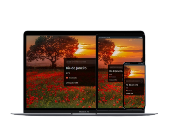

# Previsão do tempo 

Programa web que busca os dados através do consumo de uma API com o proposito de demostrar o nome da cidade escolhida, temperatura, previsão e umidade

## Construido com 🛠️

## Projeto totalmente responsivo

 
<a href="https://calculadora-simples-javascript.vercel.app/">Para acessar o projeto </a>
